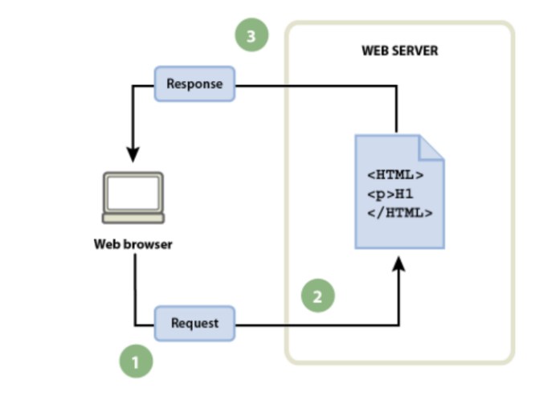

# ASIXM4-UF1-A2.-Evaluaci-n-inicial-
Actividad 2 UF1 Evaluacion Inicial


1. ¿Que es una pagina web?

    __Una página web, página electrónica, página digital o ciberpágina es un documento digital complejo, que puede integrar y/o contener texto, sonido, vídeo, programas, enlaces, imágenes, hipervínculos y otros elementos, adaptado para la World Wide Web, y que puede ser accedida y visualizada mediante un navegador web__
2. ¿Que es un sitio web?

   __Un sitio web es una colección de páginas en internet que están relacionadas entre sí y que comparten una dirección web única. Es un espacio virtual donde la información, el contenido y los servicios se presentan y se hacen accesibles para los usuarios a través de un navegador web.__

3. ¿Que es una aplicacion web?

   __En la ingeniería de software se denomina aplicación web o software web a aquella herramienta que los usuarios pueden utilizar accediendo a un servidor web a través de internet o de una intranet__

4. ¿Que es una herramienta ofimatica?

   __Ofimática (acrónimo de oficina y de informática), a veces también llamado burótica,1​ designa al conjunto de técnicas, aplicaciones y herramientas informáticas que se utilizan en funciones de oficina para optimizar, automatizar, mejorar tareas y procedimientos relacionados__

5. [Herramientas De Google](https://www.google.com/intl/es-419/chrome/browser-tools/)

 |Aplicaciones|Visto|
 |:---------|----|
 |Google Docs|✔️|
 |Google Slides|✔️|
 |Google Sheets|✔️|
 |Google Calendar|📅|
 |Google Meet|💻|
 |...|...|

 6. Que es HTML?
 ```
 <!DOCTYPE html>
 <html lang="en">
 <head>
     <meta charset="UTF-8">
     <meta http-equiv="X-UA-Comatible"content="IE=edge">
     <meta name="viewport" content="width=device-width, initial-scale=1.0">
</head>
<body>

<body>
</html>
```
 7. Que es el CSS?
 __CSS, en español «Hojas de estilo en cascada», es un lenguaje de diseño gráfico para definir y crear la presentación de un documento estructurado escrito en un lenguaje de marcado.__

 8. Flujo de trabajo (navegador, petición, servidor y respuesta):
 

